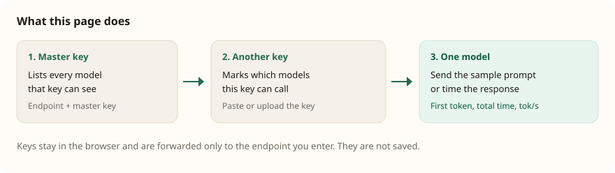

# LiteLLM model tester

A local page for checking a [LiteLLM](https://docs.litellm.ai/) proxy. A master key loads the model list. A second key is compared with that list. Any one model can be prompted, or timed for time to first token, total time, and output speed.



## What you can do

- List the models a master key can see, including mode, provider, and context size when the proxy exposes `/model/info`.
- Paste or upload a second key and see which of those models it is allowed to call. The check uses each key’s `/v1/models` list, so it does not send a completion.
- See the length and last four characters of a key before it is sent, so a truncated paste is visible.
- Show spend, budget, and rate limits for the second key when the proxy allows `/key/info`.
- Send one sample prompt to a single model, to every model the second key can call, or again to the models that failed.
- Time one model over 1, 3, or 5 runs. Chat models report time to first token, total time, and output tokens per second. Embedding models report request latency.
- Export the results as JSON. The file does not contain either key.

## Requirements

- Python 3.10 or newer
- A LiteLLM proxy URL and a master key
- [uv](https://docs.astral.sh/uv/) if you want a virtual environment. The app uses only the Python standard library.

## Run

```bash
uv venv --python 3.14
source .venv/bin/activate
python server.py
```

Open http://127.0.0.1:8787

`python3 server.py` works without the virtual environment. Use `--port` to listen somewhere other than 8787.

```bash
python server.py --port 9000
```

The server binds to `127.0.0.1` only.

## Using the page

1. Enter the proxy base URL, such as `https://llm.ecda.ai`, and the master API key. Click **List models**.
2. Paste another key, or upload a text file that contains it. A file may be the raw key, a `KEY=value` line, or JSON with `api_key`, `token`, or `key`. Click **Check access**.
3. On a model card, click **Prompt** to send the sample prompt, or **Time to first token** to measure that model. Choose 1, 3, or 5 runs first.
4. **Prompt allowed** sends the prompt only to models the second key can call. **Retry failed** repeats models that returned an error. **Export JSON** downloads the run.

If the second key field is empty, prompt and timing use the master key.

The proxy’s model list is the access check. A model missing from the second key’s list is marked **No access** and is not called. A model on the list is marked **Has access**. The prompt and timing buttons then confirm that it actually answers.

Embedding model names, and models reported as `embedding`, are sent to `/v1/embeddings`. Their timing result is request latency and vector length, not time to first token.

## Performance numbers

Each timing run streams `/v1/chat/completions` and records:

| Number | Meaning |
| --- | --- |
| Time to first token | Time from sending the request until the first text token arrives |
| Total time | Time until the stream finishes |
| Output speed | Output tokens divided by the time after the first token |

The card shows the minimum, median, and maximum of the runs you selected. Output speed is omitted when the model does not report token usage, or when the text arrives in one short burst. If a model cannot stream, the page falls back to a normal completion and reports total time only.

Runs for one model are sequential, so they do not slow each other down.

## Keys

Keys are typed into the page and sent to this local server, which forwards them to the endpoint in the form. They are not written to disk, local storage, or the export file. The page shows how many characters a key has and its last four characters. LiteLLM itself reports a key the same way (`sk-...ab12`).

The master key is the one that should see the full catalog. A virtual key normally sees only the models assigned to it. This proxy requires a key before it will list models.

## Local API

The page talks only to the local server.

| Method | Path | Purpose |
| --- | --- | --- |
| `POST` | `/api/models` | List models for the key in `token` |
| `POST` | `/api/key-info` | Budget and limits for `key`, authorized by `master_token` |
| `POST` | `/api/probe` | One non-streaming sample prompt |
| `POST` | `/api/perf` | One to five timing runs for a single model |

The local server calls these proxy routes: `/v1/models`, `/model/info`, `/key/info`, `/v1/chat/completions`, and `/v1/embeddings`.

## Limits

The model list shown in the page stops at 40 models. Timing uses the sample prompt, a temperature of 0.2, and a cap of 200 output tokens. Stopping a run in the page stops waiting for it; a request already sent to the proxy can still finish there.
